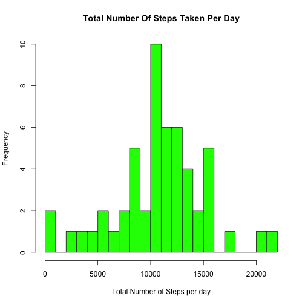
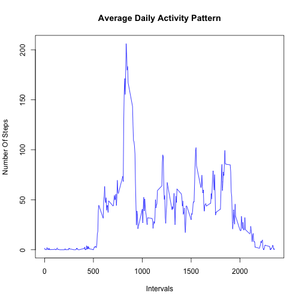
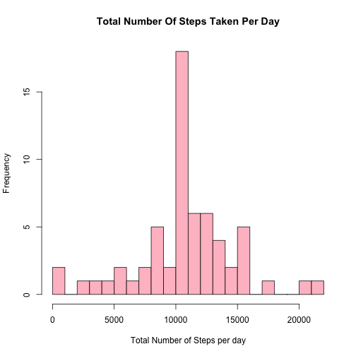
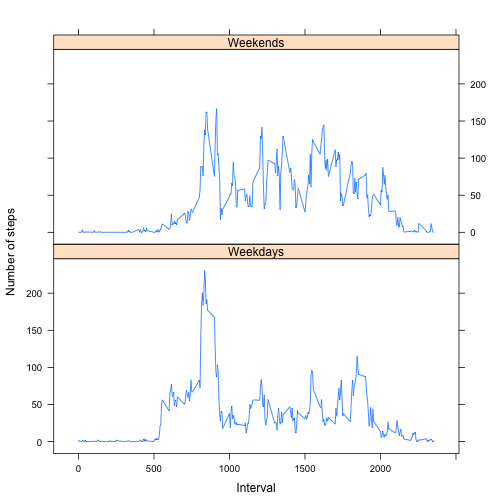

#Reproducible Research Coursera Peer Assessment Project 1

##Introduction :

It is now possible to collect a large amount of data about personal movement using activity monitoring devices such as a Fitbit, Nike Fuelband, or Jawbone Up. These type of devices are part of the “quantified self” movement – a group of enthusiasts who take measurements about themselves regularly to improve their health, to find patterns in their behavior, or because they are tech geeks. But these data remain under-utilized both because the raw data are hard to obtain and there is a lack of statistical methods and software for processing and interpreting the data.

This assignment makes use of data from a personal activity monitoring device. This device collects data at 5 minute intervals through out the day. The data consists of two months of data from an anonymous individual collected during the months of October and November, 2012 and include the number of steps taken in 5 minute intervals each day.

**Data :**

The data for this assignment can be downloaded from the course web site:

Dataset: Activity monitoring data [52K]


The variables included in this dataset are:

steps: Number of steps taking in a 5-minute interval (missing values are coded as NA)

date: The date on which the measurement was taken in YYYY-MM-DD format

interval: Identifier for the 5-minute interval in which measurement was taken

The dataset is stored in a comma-separated-value (CSV) file and there are a total of 17,568 observations in this dataset.


**This Assignment simulates and answers following questions.**  

1.What is mean total number of steps taken per day?  
2.What is the average daily activity pattern?  
3.Imputing missing values  and creating a new dataset without any missing or 'NA' data , To recalcute how mean total number of steps taken per day changes.  
4.Are there differences in activity patterns between weekdays and weekends?  

**First Loading and preprocessing csv file into suitable format for analysis (Assuming data file is in working directory)**

```r
library("dplyr")
library("lattice")
rr_assign1_data <- read.csv("activity.csv")
rr_assign1_data_o <- filter(rr_assign1_data,steps!='NA')
```

**what is the mean total number of steps taken per day ? **


```r
assign1_sum <- group_by(rr_assign1_data_o,date) %>% summarise("total_steps_perday" = sum(steps))

assign1_mean <- group_by(rr_assign1_data_o,date) %>% summarise("mean_of_steps"=mean(steps))

assign1_median <- group_by(rr_assign1_data_o,date) %>% summarise("median_of_steps" = median(steps))

mean(assign1_sum$total_steps_perday)
```

```
## [1] 10766.19
```

```r
median(assign1_sum$total_steps_perday)
```

```
## [1] 10765
```

```r
hist(as.numeric(assign1_sum$total_steps_perday),breaks=20,xlab="Total Number of Steps per day",col="green",main="Total Number Of Steps Taken Per Day")
```

 

Looking at the above histogram total mean seems to be 10766.19 and median is 10765


- Mean of the total number of steps taken per day


```r
assign1_mean
```

```
## Source: local data frame [53 x 2]
## 
##          date mean_of_steps
## 1  2012-10-02       0.43750
## 2  2012-10-03      39.41667
## 3  2012-10-04      42.06944
## 4  2012-10-05      46.15972
## 5  2012-10-06      53.54167
## 6  2012-10-07      38.24653
## 7  2012-10-09      44.48264
## 8  2012-10-10      34.37500
## 9  2012-10-11      35.77778
## 10 2012-10-12      60.35417
## ..        ...           ...
```

- Median of the total number of steps taken per day


```r
assign1_median
```

```
## Source: local data frame [53 x 2]
## 
##          date median_of_steps
## 1  2012-10-02               0
## 2  2012-10-03               0
## 3  2012-10-04               0
## 4  2012-10-05               0
## 5  2012-10-06               0
## 6  2012-10-07               0
## 7  2012-10-09               0
## 8  2012-10-10               0
## 9  2012-10-11               0
## 10 2012-10-12               0
## ..        ...             ...
```

**What is the average daily activity pattern?**


```r
rr_assign1_data_o1 <- rr_assign1_data_o %>% group_by(interval) %>% summarise(total_step=mean(steps))


with(rr_assign1_data_o1, plot(rr_assign1_data_o1$interval,rr_assign1_data_o1$total_step,type='l',xlab="Intervals",ylab="Number Of Steps",main="Average Daily Activity Pattern",col='blue') )
```

 

**Imputing missing values**

-Create a new dataset that is equal to the original dataset but with the missing data filled in.


```r
rr_assign1_data_withna <- subset(rr_assign1_data,is.na(rr_assign1_data$steps)==TRUE)

rr_assign1_data_withna$new_steps_values <- rr_assign1_data_o1$total_step
rr_assign1_data_withna <- select (rr_assign1_data_withna, new_steps_values,date,interval)
names(rr_assign1_data_withna)  <- c("steps","date","interval")

rr_assign1_data_new_o <- rbind(rr_assign1_data_o,rr_assign1_data_withna)

assign1_new_sum <- group_by(rr_assign1_data_new_o,date) %>% summarise("total_steps_perday" = sum(steps))

assign1_new_mean <- group_by(rr_assign1_data_new_o,date) %>% summarise("mean_of_steps"=mean(steps))
assign1_new_median <- group_by(rr_assign1_data_new_o,date) %>% summarise("median_of_steps" = median(steps))

mean(assign1_new_sum$total_steps_perday)
```

```
## [1] 10766.19
```

```r
median(assign1_new_sum$total_steps_perday)
```

```
## [1] 10766.19
```

```r
hist(as.numeric(assign1_new_sum$total_steps_perday),breaks=20,xlab="Total Number of Steps per day",col="pink",main="Total Number Of Steps Taken Per Day")
```

 

- Looking at the above histogram total new  mean seems to be 10766.19 and median is 10765


-New Mean when Missing data is filled and included in analysis

```r
assign1_new_mean
```

```
## Source: local data frame [61 x 2]
## 
##          date mean_of_steps
## 1  2012-10-01      37.38260
## 2  2012-10-02       0.43750
## 3  2012-10-03      39.41667
## 4  2012-10-04      42.06944
## 5  2012-10-05      46.15972
## 6  2012-10-06      53.54167
## 7  2012-10-07      38.24653
## 8  2012-10-08      37.38260
## 9  2012-10-09      44.48264
## 10 2012-10-10      34.37500
## ..        ...           ...
```
-New Median when Missing data is filled and included in analysis

```r
assign1_new_median
```

```
## Source: local data frame [61 x 2]
## 
##          date median_of_steps
## 1  2012-10-01        34.11321
## 2  2012-10-02         0.00000
## 3  2012-10-03         0.00000
## 4  2012-10-04         0.00000
## 5  2012-10-05         0.00000
## 6  2012-10-06         0.00000
## 7  2012-10-07         0.00000
## 8  2012-10-08        34.11321
## 9  2012-10-09         0.00000
## 10 2012-10-10         0.00000
## ..        ...             ...
```


**Are there differences in activity patterns between weekdays and weekends?**
  

```r
rr_assign1_data_new_o$wk_days <- weekdays(as.Date(rr_assign1_data_new_o$date))

rr_assign1_data_wkdays <- filter(rr_assign1_data_new_o,wk_days %in% c("Tuesday"  ,"Wednesday" ,"Thursday" , "Friday" ,"Monday"))

rr_assign1_data_wkenddays <- filter(rr_assign1_data_new_o,wk_days %in% c("Saturday" ,"Sunday"))


all_days_tt_no_steps <- rbind(rr_assign1_data_wkdays%>%group_by(interval)%>% summarise("sum_of_steps" = mean(steps)) %>% mutate ("Day" = "Weekdays") ,rr_assign1_data_wkenddays%>%group_by(interval)%>% summarise("sum_of_steps" = mean(steps)) %>% mutate("Day" = "Weekends") )

xyplot(sum_of_steps~interval|all_days_tt_no_steps$Day,data=all_days_tt_no_steps,type='l',layout=c(1,2),ylab="Number of steps" , xlab="Interval")
```

 

Looking at the above panel plot, An obervation can be made that during weekdays the activity starts to rise from 6 am to 10 am  whereas during weekends the activity seems to rise between 8 am to 10 am . Also between 10 am - 5 pm weekends have higher activities than the weekdays.  


